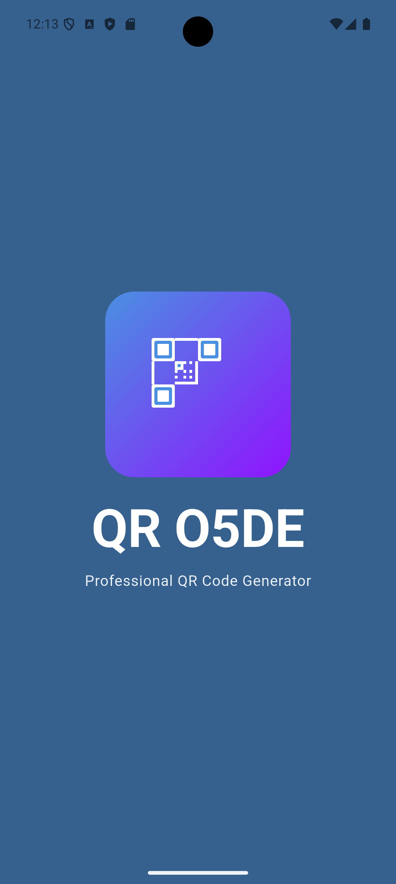
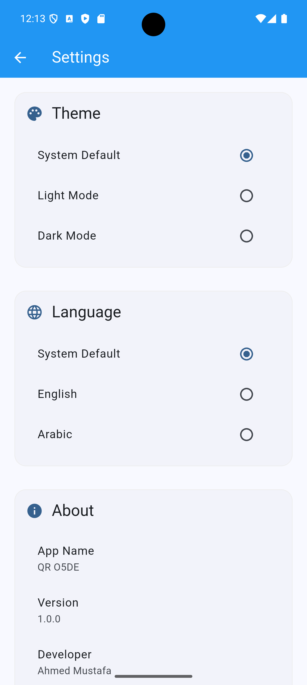

# QR-O5DE 🚀

A modern Flutter QR Code Generator & Scanner app with dark/light mode, system language support, and a clean, responsive UI.

QRo5de is a Flutter-based mobile app that allows users to generate and scan QR codes easily and efficiently. The app features a modern, responsive design, smooth performance, dark/light theme support, and automatic language detection based on the device system.

## 📸 Screenshots

| Splash & Home | Generator | History | Settings |
| :---: | :---: | :---: | :---: | :---: |
|  |  |  |  |

## 🚀 Features

- ✅ **Generate QR codes** from text, URLs, phone numbers, and more.
- 📷 **Scan QR codes** using the device camera.
- 💾 **Save** generated QR codes as images.
- 📤 **Share** QR codes with other apps.
- 🌓 **Dark Mode & Light Mode** support.
- 🌍 **Automatic system language detection** (Arabic / English).
- 📜 **History screen** for saved and scanned QR codes.
- 🎨 **Modern UI** using Material 3.
- ⚡ **Fast performance** and smooth user experience.

## 🧭 How to Use

1. **Open the app**
2. Select **Generate QR** to create a new QR code.
3. Enter the text or link you want to encode and tap **Generate**.
4. **Save or share** the QR code.
5. Use **Scan QR** to scan QR codes using the camera.
6. View saved codes in the **History** section.

## 🛠️ Build & Run the Project

### Requirements
- Flutter SDK (latest stable version)
- Android Studio or VS Code
- Android Emulator or Physical Device

### Installation
1. Clone the repository:
   ```bash
   git clone https://github.com/am6888122-lang/QR-O5DE.git
   ```
2. Install dependencies:
   ```bash
   flutter pub get
   ```
3. Run the app:
   ```bash
   flutter run
   ```

## 🧰 Tech Stack
- **Framework**: Flutter
- **Language**: Dart
- **UI**: Material 3
- **App Name**: QRo5de
- **Package**: com.injaz.qro5de
- **Platform**: Android / iOS

---
Made with ❤️ by [am6888122-lang](https://github.com/am6888122-lang)

